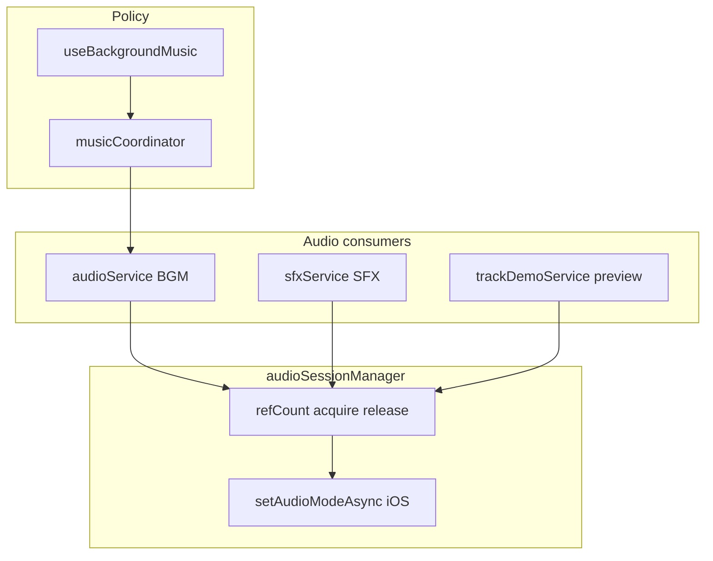
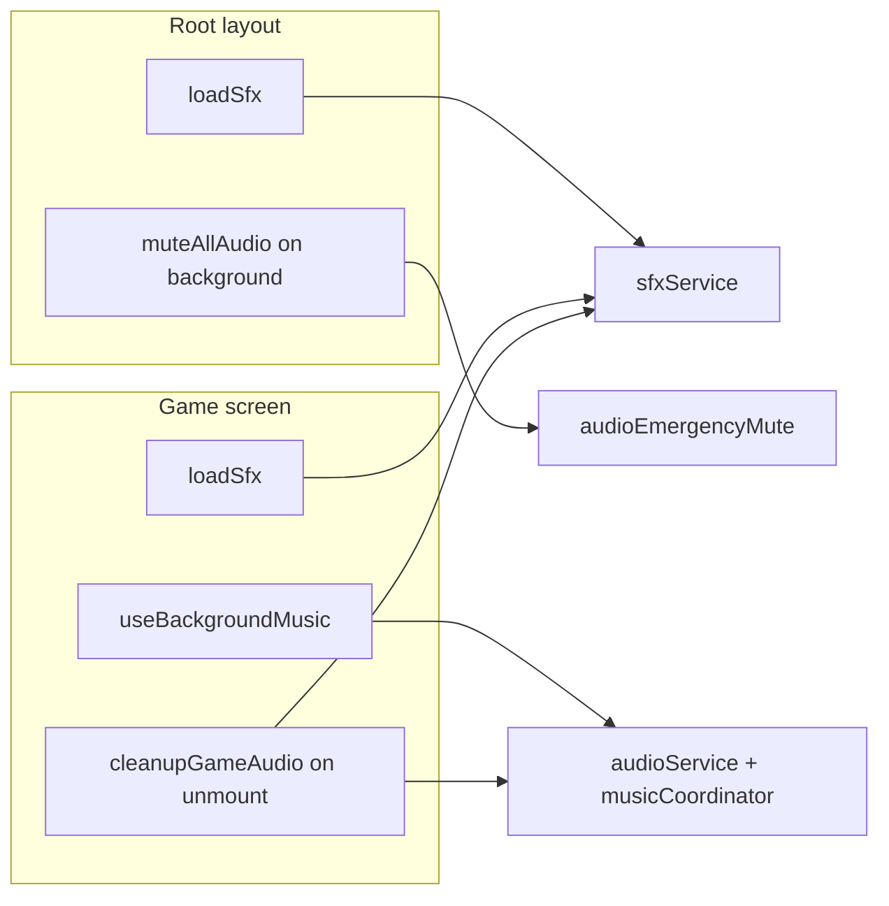

# Audio system architecture (music, SFX, session)

This document describes how background music, sound effects, and the iOS audio session are wired in Sudokitty (React Native / Expo). It is written for engineers debugging **intermittent playback** or extending audio behavior.

## Purpose

- Map responsibilities across modules (single source of truth per concern).
- Explain settings, hydration gates, and lifecycle (root layout vs game screen).
- List **known weaknesses** and a practical debugging order.

## Stack

| Layer     | Technology                                                  |
| --------- | ----------------------------------------------------------- |
| Playback  | `expo-av` — `Audio.Sound` for BGM, SFX, and track previews  |
| Session   | Custom ref-counted wrapper around `Audio.setAudioModeAsync` |
| State     | Zustand (`settingsStore`, `gameStore`, `ownedTracksStore`)  |
| Lifecycle | React hooks + `AppState` listeners                          |

`expo-av` is loaded via dynamic `import()` in several services so the bundle does not assume the native module is present at parse time; failed loads log a warning and no-op.

## High-level architecture

**Lifecycle (where things start and stop):**

## File map

| Module           | Path                                  | Responsibility                                                                                                   |
| ---------------- | ------------------------------------- | ---------------------------------------------------------------------------------------------------------------- |
| Session          | `src/services/audioSessionManager.ts` | Ref-counted `acquire` / `release`; debounced deactivate (150ms); switches iOS audio mode when refCount hits 0    |
| Background music | `src/services/audioService.ts`        | Single looping `Sound`; load/unload; play/pause; fade; `switchTrack` (crossfade → unload → load)                 |
| Music policy     | `src/services/musicCoordinator.ts`    | Derives `playing` / `silent` / `preview`; coordinates with track preview; `resyncAfterAudioReady` for load races |
| Game hook        | `src/hooks/useBackgroundMusic.ts`     | Wires coordinator to `musicEnabled`, `gameStatus`, `AppState`, hydration, active track                           |
| SFX              | `src/services/sfxService.ts`          | Map of `SfxId` → `Sound`; `loadSfx`, `playSfx`, `unloadSfx`, `muteNow`                                           |
| Track preview    | `src/services/trackDemoService.ts`    | Temporary demo `Sound` for store/selector previews; own timers and session acquire/release per demo              |
| Emergency mute   | `src/services/audioEmergencyMute.ts`  | `muteAllAudio()` — forwards to BGM, SFX, demo `muteNow`                                                          |
| Game teardown    | `src/services/gameAudioCleanup.ts`    | Ordered cleanup when leaving game: coordinator prepare → cancel fade → mute → unload BGM → unload SFX            |
| Feedback API     | `src/utils/feedback.ts`               | Semantic `FeedbackId` → `playSfx` + haptics                                                                      |
| Tracks metadata  | `src/constants/backingTracks.ts`      | `BackingTrackDef`, `getTrackById`                                                                                |
| Settings         | `src/stores/settingsStore.ts`         | `soundsEnabled`, `musicEnabled`, hydration markers                                                               |
| Owned tracks     | `src/stores/ownedTracksStore.ts`      | `activeTrackId` for which backing track to load (with `getTrackById` in `useBackgroundMusic`)                    |
| Root             | `app/_layout.tsx`                     | App-wide `loadSfx`; `muteAllAudio` on `inactive` / `background`                                                  |
| Game             | `app/game.tsx`                        | `useBackgroundMusic`; `loadSfx` on mount; `cleanupGameAudio` on unmount                                          |

## Settings: `musicEnabled` vs `soundsEnabled`

These flags are **independent** (see comments in `settingsStore.ts`):

- **`musicEnabled`** — Background music only. When false, BGM is not loaded (avoids acquiring the audio session for music).
- **`soundsEnabled`** — Short SFX only (`playSfx`). Does not stop background music.

Toggling sounds in the UI does not automatically unload SFX; unload is primarily driven by **game screen unmount** (`cleanupGameAudio` → `unloadSfx`). While sounds are off, `playSfx` returns early unless `force` is used (e.g. settings preview).

## Settings hydration

AsyncStorage rehydration can briefly expose default `true` for toggles before persisted values apply. The app uses:

- `hasSettingsHydrated()` / `waitForSettingsHydration()` — resolved when Zustand `persist` `onRehydrateStorage` runs (`markSettingsHydrated()`).

**Effects:**

- `useBackgroundMusic` waits for hydration before loading BGM or calling `musicCoordinator.sync`, so users with music off do not flash an audio session.
- `loadSfx` awaits hydration, then returns without loading if `soundsEnabled` is false.

## Session manager contract (`audioSessionManager`)

- **`acquire()`** — Increments `refCount`. On first acquire after idle: `Audio.setAudioModeAsync` with `playsInSilentModeIOS: true`, `staysActiveInBackground: false`, `interruptionModeIOS: DuckOthers`.
- **`release()`** — Decrements `refCount`. When it reaches zero, a **debounced** timer (150ms) runs `deactivateSessionIfIdle`, which sets a quieter mode: `playsInSilentModeIOS: false`, `interruptionModeIOS: MixWithOthers`.

Each subsystem that loads audio should balance acquire with release on unload:

| Consumer | Acquire                    | Release                   |
| -------- | -------------------------- | ------------------------- |
| BGM      | `loadBackgroundMusic`      | `unload`                  |
| SFX      | `loadSfx` / `loadSfxForce` | `unloadSfx`               |
| Demo     | `playDemo`                 | end of demo or `stopDemo` |

Multiple consumers can hold the session simultaneously; refCount sums their needs.

## Music pipeline

1. **Load** — `useBackgroundMusic` calls `audioService.loadBackgroundMusic(track?.asset)` when `musicEnabled` and settings are hydrated. On success, `musicCoordinator.resyncAfterAudioReady()` fixes the case where `sync` ran before load finished (see below).
2. **Policy** — `musicCoordinator.sync({ musicEnabled, appActive, gameStatus, activeTrackId })` derives a mode:
   - **`playing`** — Music should be audible (faded to `MUSIC_VOLUME`, 0.35 in coordinator / service).
   - **`silent`** — Music off, app not active, or game ended (`won` / `lost`): fade out, pause.
   - **`preview`** — Track demo in store/selector; BGM is suspended while demo plays.
3. **App background** — `appActive === false` → silent. Separate from root `muteAllAudio` (see Global lifecycle).
4. **Track switch** — When `activeTrackId` changes and audio is already loaded, `audioService.switchTrack` crossfades, unloads, reloads, and may resume via coordinator `resyncAfterAudioReady`.
5. **Teardown** — Leaving the game screen runs `cleanupGameAudio`, which unloads BGM after muting.

### `resyncAfterAudioReady` (race self-heal)

If `sync()` runs while `!audioService.isLoaded()`, `applyTransition` no-ops for playback but `currentMode` may already be `"playing"`. Later `sync` calls see no mode change and never start playback. `resyncAfterAudioReady` detects “should be playing but not playing” and resets coordinator state then calls `sync(lastInputs)` again.

## SFX pipeline

1. **Assets** — `SFX_ASSETS` maps `SfxId` to Metro `require()` asset IDs in `sfxService.ts`.
2. **Preload** — `loadSfx()` (after hydration) acquires session and creates one `Sound` per id. Per-clip failures are swallowed; that id becomes a no-op.
3. **Play** — `playSfx(id, { force? })` checks `soundsEnabled` unless `force`. If `!loaded`, it calls `loadSfx()` or `loadSfxForce()` (settings preview).
4. **Playback** — `setPositionAsync(0)` then `playAsync()`. **Volume is set only at `createAsync` time** (`SFX_VOLUME` 0.7), not on every play.
5. **Unload** — `unloadSfx` zeros volume, unloads all instances, clears the map, and `release()`s the session once if SFX had been loaded.

### Feedback entry point

Application code should prefer `playFeedback` / `FeedbackId` from `src/utils/feedback.ts` so haptics and SFX stay aligned with product semantics.

## Global lifecycle: root vs game

### Root (`app/_layout.tsx` — `RootLayoutNav`)

- **`loadSfx()`** on mount — Preloads SFX app-wide (e.g. store bursts before opening the game).
- **`AppState`** — On `inactive` or `background`, calls **`muteAllAudio()`** (volume to 0 on BGM, all SFX, demo). Does **not** unload sounds or pause coordinator by itself.

### Game (`app/game.tsx`)

- **`useBackgroundMusic()`** — Owns BGM policy while the game screen is mounted.
- **`loadSfx()`** on mount — Redundant if root already loaded; `loadSfx` is idempotent when `loaded` is true.
- **Unmount** — `cleanupGameAudio()` — Stops coordinator preview, cancels fades, mutes, unloads BGM and SFX.

### Interaction: backgrounding

Two mechanisms run:

1. **Global** — `muteAllAudio` sets volumes to 0.
2. **Game (if mounted)** — `useBackgroundMusic` passes `appActive: false` into `musicCoordinator.sync`, which fades and pauses BGM per policy.

There is no symmetric “unmute” in root layout when returning to foreground; BGM volume is restored through **`musicCoordinator`** when `appActive` is true and mode is `playing` (fade to `MUSIC_VOLUME`). SFX are **not** automatically restored to `SFX_VOLUME` after `muteAllAudio` (see Known weaknesses).

## Track preview

`musicCoordinator.startPreview` sets `previewActive`, may fade/pause BGM, then `trackDemoService.playDemo` creates a dedicated `Sound`, `session.acquire()`s, and `release()`s when the demo ends or is stopped. `stopPreview` clears preview state and `sync(lastInputs)` restores BGM if allowed.

## Known weaknesses and failure modes

Ordered roughly by how often they explain “sometimes it plays, sometimes it doesn’t.”

### 1. SFX stay at volume 0 after `muteAllAudio` (high impact)

`muteAllAudio` → `sfxService.muteNow()` sets **every loaded SFX** to volume `0`. `playSfx` does not call `setVolumeAsync(SFX_VOLUME)` before playing. If `loaded` remains `true`, subsequent `playSfx` calls can be **silent** until `unloadSfx` + reload (e.g. re-entering game) or a code path recreates sounds at full volume.

Background music is less affected because `musicCoordinator` fades back to `MUSIC_VOLUME` when policy returns to `playing`.

**Reproduction hint:** Background the app from a screen where SFX were preloaded, foreground, trigger SFX without navigating away (so no unload).

### 2. Dual `AppState` listeners (medium)

Root layout and `useBackgroundMusic` both subscribe to app state. Root mutes globally; the coordinator pauses/fades BGM. They are not coordinated by a single mutex; ordering can vary. Usually both run; edge cases may combine volume-0 SFX with coordinator state.

### 3. Session ref-count and partial failures (medium)

If `createAsync` fails for some SFX, those ids are missing but `loaded` may still become true after the batch. If unload partially fails, ref-count and `loaded` flags could theoretically diverge; errors are largely swallowed.

### 4. `musicCoordinator.disposed` (low, scoped)

`cleanupGameAudio` → `prepareForGameCleanup` sets `disposed` and bumps `transitionId` so in-flight transitions abort. `init()` runs again on the next game mount. Calling coordinator APIs expecting music updates **off the game screen** may not match intuition if the game unmounted.

### 5. `expo-av` missing in dev (medium in dev only)

If the native module is not linked, dynamic import fails; `audioService` logs a rebuild hint. Symptom: no audio anywhere.

### 6. Intentional self-heals (do not duplicate blindly)

- **`resyncAfterAudioReady`** — Fixes coordinator stuck after load lag; do not remove without replacing the race fix.
- **`playSfx` reload when `!loaded`** — Recovers after `unloadSfx` (e.g. post-game); does not fix volume-0 while `loaded === true`.

## Debugging checklist

1. Confirm `soundsEnabled` / `musicEnabled` and **hydration** (`hasSettingsHydrated`).
2. Check whether **`muteAllAudio`** ran recently; for SFX, verify volume or force `unloadSfx` + `loadSfx` path.
3. For BGM: `audioService.isLoaded()`, game `gameStatus`, `appActive`, `musicCoordinator` mode (preview vs playing).
4. For dev: confirm `expo-av` native build.
5. Log or breakpoint `audioSessionManager` refCount only if investigating session deactivation pops or ducking issues.

## Optional follow-ups (not implemented)

These are architectural improvements suggested by the issues above; they are **not** part of the current codebase unless implemented explicitly.

- After foreground, restore SFX volume (e.g. `setVolumeAsync(SFX_VOLUME)` in `playSfx`, or a dedicated `restoreAfterMute` called from a single `AppState` handler).
- Consolidate `AppState` handling into one module that applies mute + coordinator + SFX restore in a defined order.
- Consider explicit `pauseAsync` for SFX on background instead of volume-only mute if iOS behavior requires it.

---

_Last updated to match the implementation in the Sudokitty RN app (`src/services/_`, `app/\_layout.tsx`, `app/game.tsx`).\*
